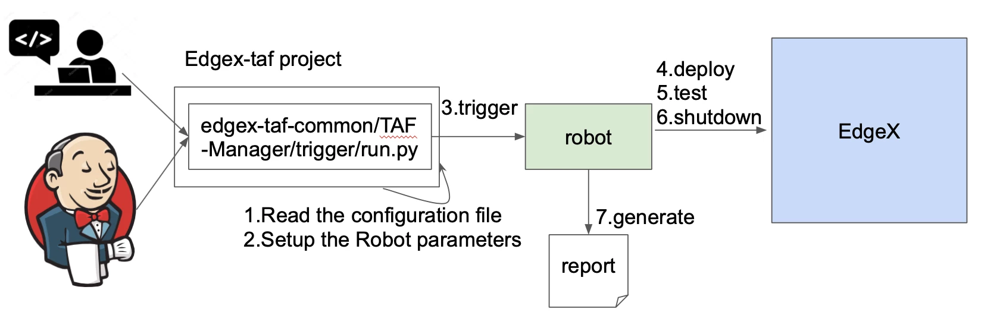
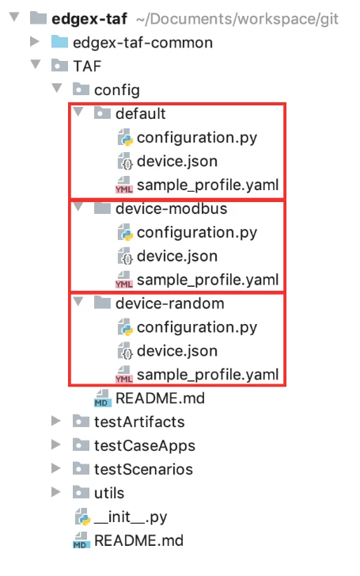
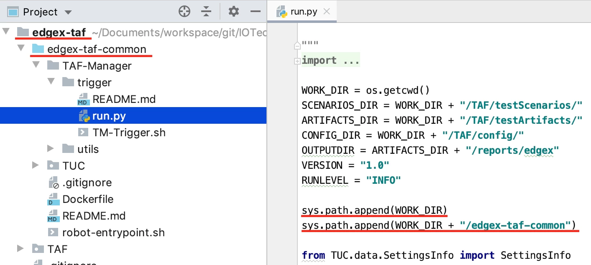
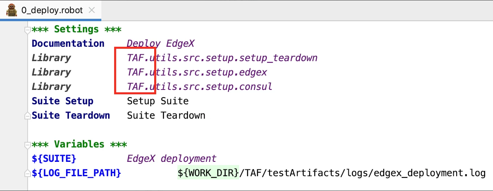
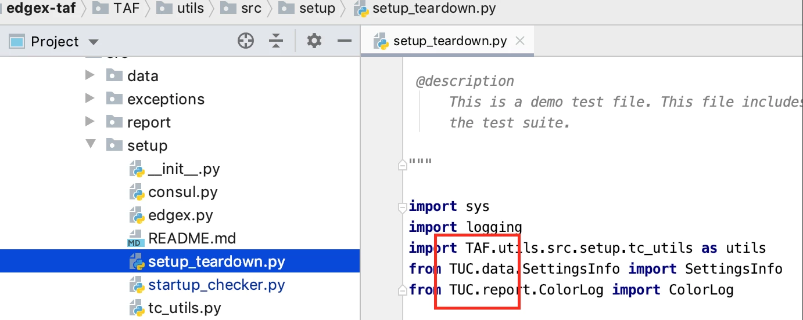
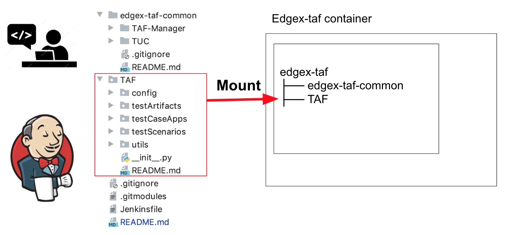

#########
EdgeX-taf
#########

ITAF Architecture Choices:

* Well -defined Test Code Structure.
* Test application code that narrates the use case scenarios are written using human-readable syntax with ROBOT tool.
* Abstraction of test case code from test application code. Test case code are ROBOT Keywords defined in Python/ROBOT.
* Separation of configuration data from test case application code. Configuration data can be in several formats including JSON, YAML, .cfg etc.
* Separate test logs/reports from test application code.
* Common test code utilities that are documented and catalogued for cross workgroup group reuse.
* Embrace other test aid tools and test scope like JMETER, Selenium, postman, console-cli etc.
* Integration with Jenkins facilitated by TAF Manager

Overview
========

* Edgex-taf provides a well-defined project structure for the configuration and test cases, test scripts, and test report
* Edgex-taf-common provides a place for reusable scripts

How to Create an EdgeX-taf Project
==================================

To write the automation testing with edgex-taf framework, complete the following steps:

1. Clone the edgex-taf project from EdgeX Foundry as a template::

       git clone git@github.com:edgexfoundry/edgex-taf.git

2. Install pre-request packages:

   Download pip3 and run this command::

       pip3 install edgex-taf/requirements.txt

3. The edgex-taf project includes an empty edgex-taf-common submodule. Run the following commands to initialize your local configuration file and fetch all the data from that project::

       cd edgex-taf
       git submodule init
       git submodule update --remote

4. Edit your config and utils under TAF directory:

   .. image:: images/Edgex-taf-TAF.png
       :scale: 50%
       :alt: Edgex-taf TAF directory

5. Put the ROBOT based Test Application code under "use case" folder prefixed with "UC_" in the TAF/testScenarios folder

   Create a robot test case must contain the Settings, Variables and Keywords shown below

   .. image:: images/Edgex-taf-Robot.png
       :scale: 50%
       :alt: Edgex-taf Robot Test application

6. Put the test case code in the TAF/testCaseApps folder

7. Navigate to the edgex-taf root path and Run the tests using the following commands::

       python3 edgex-taf-common/TAF-Manager/trigger/run.py -u '*'

Configuration Profiles

Edgex-taf defines the configuration folder separated by different profiles; the user can trigger the testing using the profile name. 

For example, to run the certification testing for **device-random**::

    python3 edgex-taf-common/TAF-Manager/trigger/run.py -p device-random -u '*'

Or to run the certification testing for **device-modbus**::

    python3 edgex-taf-common/TAF-Manager/trigger/run.py -p device-modbus -u '*'

To run the default certification testing::

    python3 edgex-taf-common/TAF-Manager/trigger/run.py -u '*'

Python System Path Setup
========================

We use the project root path and edgex-taf-common as the system path. The python module names are **TAF** and **TUC**. This is illustrated below:

|

|

Using the EdgeX-taf-common docker Container
===========================================

Trigger the testing using edgex-taf-common/TAF-Manager/trigger/run.py. It must install the robotframework and required tools; we built a docker image to wrap all required tools, so that the user could trigger testing without installing any dependencies. Users only need to mount the testing scripts and trigger the testing.

Build the edgex-taf-common docker Image
---------------------------------------

1. Use git to clone edgex-taf-common::

       git clone https://github.com/edgexfoundry-holding/edgex-taf-common.git

2. Change the directory to edgex-taf-common and execute the command::

       cd edgex-taf-common
       docker build -t docker-edgex-taf-common:1.1.1 .

3. Push to the docker registry::

       docker push docker-edgex-taf-common:1.1.1

Run the Tests
=============

Run the complete test suite as follows::

    docker run --rm --network host -v ${PWD}:${PWD} -w ${PWD} \
        -v /var/run/docker.sock:/var/run/docker.sock \
        docker-edgex-taf-common:1.1.1 \
        -u .

Run a test suite as follows::

    docker run --rm --network host -v ${PWD}:${PWD} -w ${PWD} \
        -v /var/run/docker.sock:/var/run/docker.sock \
        docker-edgex-taf-common:1.1.1 \
        -t DS_Certification/0_deploy.robot

