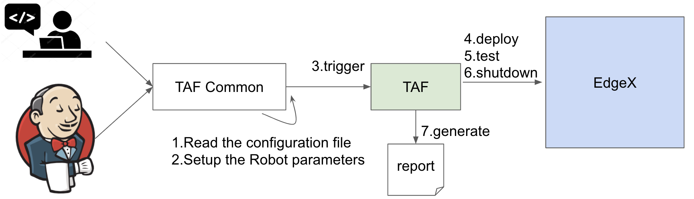

# EdgeX TAF

ITAF Architecture Choices:

- Well -defined Test Code Structure.
- Test application code that narrates the use case scenarios are written using human-readable syntax with ROBOT tool.
- Abstraction of test case code from test application code. Test case code are ROBOT Keywords defined in Python/ROBOT.
- Separation of configuration data from test case application code. Configuration data can be in several formats including JSON, YAML, .cfg etc.
- Separate test logs/reports from test application code.
- Common test code utilities that are documented and catalogued for cross workgroup group reuse.
- Embrace other test aid tools and test scope like JMETER, Selenium, postman, console-cli etc.
- Integration with Jenkins facilitated by TAF Manager

## Overview



- TAF(https://github.com/edgexfoundry/edgex-taf) provides a well-defined project structure for the configuration and test cases, test scripts, and test report
- TAF Common(https://github.com/edgexfoundry/edgex-taf-common) provides a place for reusable scripts and Robotframework usage
- All testing target and dependency should provide the docker image or installation script for automation testing job. For example, device-modbus testing should provide device-modbus docker image and Modbus device simulator docker image or installation script.
- TAF should provide xUnit format testing results which Jenkins server can generate statistics.
    - https://robotframework.org/robotframework/latest/RobotFrameworkUserGuide.html#xunit-compatible-result-file
    - https://plugins.jenkins.io/xunit
- TAF should provide HTML format testing result
    - https://robotframework.org/robotframework/latest/RobotFrameworkUserGuide.html#report-file


## Getting Start with Virtual Device Service

To write the automation testing for virtual device service, complete the following steps:

1. **Prerequisites**

    1.  Clone the edgex-taf project from EdgeX Foundry as a template:

        ``` bash
        git clone git@github.com:edgexfoundry/edgex-taf.git
        ```

    2. Install pre-request packages. Download pip3 and run this command:

        ``` bash
        pip3 install edgex-taf/requirements.txt
        ```

    3. Install TAF common:

        ``` bash
        git clone git@github.com:edgexfoundry/edgex-taf-common.git

        # Install dependency lib
        pip3 install -r ./edgex-taf-common/requirements.txt

        # Install edgex-taf-common as lib
        pip3 install ./edgex-taf-common
        ```


2. **Add configuration**

    1. Copy the default folder and rename to device-virtual:

        ```
        TAF/config
        ├── README.md
        ├── global_variables.py
        ├── default
        │   ├── configuration.py
        │   ├── configuration.toml
        │   ├── docker
        │   │   └── configuration.toml
        │   └── sample_profile.yaml
        └── device-virtual
            ├── configuration.py
            ├── configuration.toml
            ├── docker
            │   └── configuration.toml
            └── sample_profile.yaml
        ```

    2. Modify properties for testing:

        ``` toml
        [TAF/config/device-virtual/configuration.py]

        SERVICE_NAME = "device-virtual"
        SERVICE_PORT = 49990
        ```

    3. Provide the configuration.toml file and modify the ProfilesDir property value to "/custom-config":

        ```
        TAF/config
        └── device-virtual
            ├── configuration.toml
            └── docker
                   └── configuration.toml

        [Device]
            ...
            ProfilesDir = "/custom-config"
        ```

3. **Prepare test data**

    1. Remove string data type because device-virtual only support boolean, float and integer:

        ```
        [TAF/config/device-virtual/configuration.py]

        SUPPORTED_DATA_TYPES = [
            #     Boolean
            ...

            #     Float
            ...

            #     Integer
            ...

            #     Unsigned Integer
            ...
        ]
        ```

    2. Add the protocol properties with name same as ${SERVICE_NAME} on TAF/testData/core-metadata/device_protocol.json, the property key and value are base on the DS implementation::

        ``` json
        {
            "edgex-devic-modbus": {
                "modbus-tcp": {
                    "Address": "edgex-modbus-simulator",
                    "Port": "1502",
                    "UnitID": "1"
                }
            },
            "device-virtual": {
                "other": {
                    "Address": "simple01",
                    "Port": "300"
                }
            }
        }
        ```

4. **Add the DS to the docker-compose File**

    In this document, we deploy all services using docker, so we must add the docker images to the docker-compose file, as illustrated below:

    ``` yaml
    # TAF/utils/scripts/docker/device-service.yaml

    device-virtual:
        image: edgexfoundry/docker-device-virtual-go:1.0.0
        ports:
        - "49990:49990"
        container_name: edgex-device-virtual
        hostname: edgex-device-virtual
        networks:
        edgex-network:
            aliases:
            - edgex-device-virtual
        volumes:
        - db-data:/data/db
        - log-data:/edgex/logs
        - consul-config:/consul/config
        - consul-data:/consul/data
        - ${WORK_DIR}/TAF/config/${PROFILE}:${CONF_DIR}
        depends_on:
        - data
        - command
        entrypoint:
        - /device-virtual
        - --profile=${DS_PROFILE}
        - --registry=${REGISTRY_URL}
        - --confdir=${CONF_DIR}
    ```

5. **Run testing**

    Navigate to the edgex-taf root path and Run the tests using the following commands

    1. Prepare test environment:

        ``` bash
        # Fetch the latest docker-compose file
        cd TAF/utils/scripts/docker
        sh get-compose-file.sh ${USE_DB} ${ARCH} ${USE_SECURITY}

        # export the environment variable which depend on your machine
        ${USE_DB}: -redis | -mongo (mongo is not supported from hanoi release)
        ${ARCH}: x86_64 | arm64
        ${USE_SECURITY}: - (false) | -security- (true)
        ```

    2. Deploy edgex:

        ``` bash
        python3 -m TUC --exclude Skipped --include deploy-base-service -u deploy.robot -p default
        ```

    3. Deploy Device Service:

        ``` bash
        python3 -m TUC --exclude Skipped --include deploy-device-service -u deploy.robot -p device-virtual
        ```

    4. Run testing:

        ``` bash
        python3 -m TUC --exclude Skipped -u functionalTest/device-service/common -p device-virtual
        ```

    5. Open the Test Reports

        Open the test reports in the browser. For example, to open the testing report, enter the following URL in the browser `path/to/edgex-taf/TAF/testArtifacts/reports/edgex/log.html`

    6. Shutdown edgex:

        ``` bash
        python3 -m TUC --exclude Skipped --include shutdown-edgex -u shutdown.robot -p default
        ```

## Add New Testing

Put the ROBOT based Test Application code under "use case" folder prefixed with "UC_" in the `TAF/testScenarios` folder.  The robot test case must contain the Settings, Variables and Keywords, the example shown below:


|**Settings**||
|---|---|
|Documentation|    DS Ping Testing|
|Library|          `TAF/testCaseModules/keywords/setup/setup_teardown.py`|
|Library|          `TAF/testCaseModules/keywords/setup/edgex.py`|
|Library|          `TAF/testCaseModules/keywords/setup/consul.py`|
|Suite Setup|      Setup Suite|
|Suite Teardown|   Suite Teardown|

|**Variables**||
|---|---|
|${SUITE}|                  DS Ping Testing|
|${LOG_FILE_PATH}|          `${WORK_DIR}/TAF/testArtifacts/logs/ds_ping.log`|
|${DEVICE_SERVICE_URL}|     `http://localhost:${DEVICE_SERVICE_PORT}`|


**Keywords**
```
# Setup called once before all test cases.
Setup Suite
    ${status} =  Suite Setup  ${SUITE}  ${LOG_FILE_PATH}  ${LOG_LEVEL}
    Should Be True  ${status}  Failed Suite Setup
```

**Test Cases**
```
Test ping API
    When Send GET request "/api/v1/ping" to "${DEVICE_SERVICE_URL}"
    Then Status code "${REST_RES.status_code}" should be "200"
    And Validate ${REST_RES.content} contains version element "1.1.0"
```

## Configuration Profiles

Edgex-taf defines the configuration folder separated by different profiles; the user can trigger the testing using the profile name:

```
TAF/config
├── device-modbus
└── device-random
```

For example, to run the DS testing for **device-random**:

``` bash
    python3 -m TUC -p device-random -u functionalTest/device-service/common
```

Or to run the DS testing for **device-modbus**:

``` bash
    python3 -m TUC -p device-modbus -u functionalTest/device-service/common
```


### How to use the configuration in the testing script

Define constant in the configuration.py:

``` python
#global_variables.py
    # EdgeX host
    BASE_URL = "localhost"

# configuration.py
    # Service for testing
    SERVICE_NAME = "device-virtual"
    SERVICE_PORT = 49990
```

Pass the constant to the robot file or python code:

``` python
# coreCommandAPI.robot
    *** Variables ***
    ${coreCommandUrl}  http://${BASE_URL}:${CORE_COMMAND_PORT}

# startup_checker.py
    conn = http.client.HTTPConnection(host=SettingsInfo().constant.BASE_URL, port=d["port"], timeout=httpConnTimeout)
```

You can reference the following URL for more details on variables usage
https://robotframework.org/robotframework/latest/RobotFrameworkUserGuide.html#variable-priorities-and-scopes

## Python System Path Setup

We use the project root path as the system path. The python module names are **TAF**.

The usage for robot file is:  `TAF/testScenarios/functionalTest/deploy-edgex.robot`

|**Settings**||
|---|---|
|Documentation|    Deploy EdgeX|
|Library|          `TAF/testCaseModules/keywords/setup/setup_teardown.py`|
|Library|          `TAF/testCaseModules/keywords/setup/edgex.py`|

The usage for python script is illustrated below:

```
TAF/testCaseModules/keywords/setup/edgex.py

from TUC.data.SettingsInfo import SettingsInfo
import startup_checker as checker
```

## Using the EdgeX-taf-common docker Container

### Used variable value:

``` 
${USE_DB}: -redis | -mongo (mongo is not supported from hanoi release)
${ARCH}: x86_64 | arm64
${USE_SECURITY}: - (false) | -security- (true)
${COMPOSE_IMAGE}: nexus3.edgexfoundry.org:10003/edgex-devops/edgex-compose:latest
${SECURITY_SERVICE_NEEDED}: false | true
${profile}: device-virtual | device-modbus
```

### Preparation

1. Get compose file from developer-script repo:

    ``` bash
    cd TAF/utils/scripts/docker
    sh get-compose-file.sh ${USE_DB} ${ARCH} ${USE_SECURITY}
    ```

2. Deploy edgex:

    ``` bash
    docker run --rm --network host -v ${PWD}:${PWD} -w ${PWD} \
        -e COMPOSE_IMAGE=${COMPOSE_IMAGE} -e USE_DB=${USE_DB} \
        -e SECURITY_SERVICE_NEEDED=${SECURITY_SERVICE_NEEDED} \
        -v /var/run/docker.sock:/var/run/docker.sock \
        docker-edgex-taf-common --exclude Skipped \
        --include deploy-base-service -u deploy.robot -p default
    ```

### Functional Test

1. Deploy Device Service:

    ``` bash
    docker run --rm --network host -v ${PWD}:${PWD} -w ${PWD} \
        -e COMPOSE_IMAGE=${COMPOSE_IMAGE} -e ARCH=${ARCH} \
        -e SECURITY_SERVICE_NEEDED=${SECURITY_SERVICE_NEEDED} \
        -v /var/run/docker.sock:/var/run/docker.sock \
        docker-edgex-taf-common --exclude Skipped \
        --include deploy-device-service -u deploy.robot -p ${profile}
    ```

2. Run testing:

    ``` bash
    docker run --rm --network host -v ${PWD}:${PWD} -w ${PWD} \
        -e COMPOSE_IMAGE=${COMPOSE_IMAGE} -e ARCH=${ARCH} \
        -e SECURITY_SERVICE_NEEDED=${SECURITY_SERVICE_NEEDED} \
        -v /var/run/docker.sock:/var/run/docker.sock \
        docker-edgex-taf-common --exclude Skipped \
        -u functionalTest/device-service/common -p ${profile}
    ```

### Integration Test

Run testing:

``` bash
docker run --rm --network host -v ${PWD}:${PWD} -w ${PWD} \
    -e COMPOSE_IMAGE=${COMPOSE_IMAGE} -e ARCH=${ARCH} \
    -e SECURITY_SERVICE_NEEDED=${SECURITY_SERVICE_NEEDED} \
    -v /var/run/docker.sock:/var/run/docker.sock \
    docker-edgex-taf-common --exclude Skipped \
    -u integrationTest -p device-virtual
```

### Open the Test Reports

Open the test reports in the browser. For example, to open the testing report, enter the following URL in the browser: `TAF/testArtifacts/reports/edgex/log.html`

### Shutdown

``` bash
docker run --rm --network host -v ${PWD}:${PWD} -w ${PWD} \
    -e COMPOSE_IMAGE=${COMPOSE_IMAGE} \
    -v /var/run/docker.sock:/var/run/docker.sock \
    docker-edgex-taf-common --exclude Skipped \
    --include shutdown-edgex -u shutdown.robot -p default
```

## Test Report Example

**Suite level example**


**Test case level example**


**Keyword level example**


