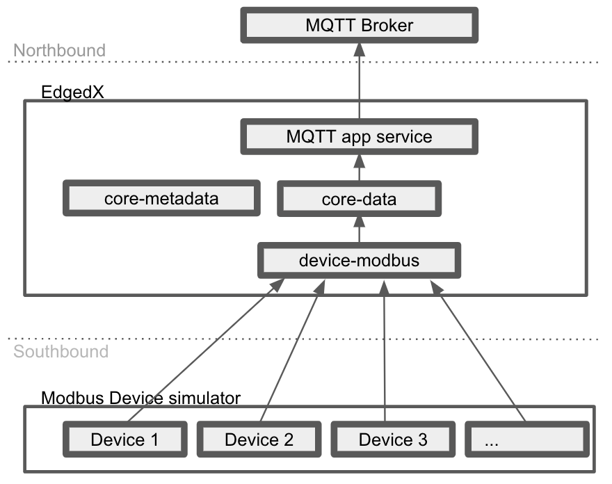

# Modbus Scalability Test
Modbus Scalability Test is used to measure the EdgeX's ability when the device number scale-up.

## Test Environment Overview


Since the test needs to handle a lot of ports for Modbus simulators, so we consider using the host network with docker https://docs.docker.com/network/host/, and the host networking driver only works on Linux hosts.

Required tool:
- docker
- docker-compose

## Prepare Test Environment

### 1. Deploy southbound Modbus simulator
Run the following command to deploy simulators:
```
# x86_64
docker run --rm -d --network host --name modbus-simulator \
    -e SIMULATOR_NUMBER=1000 -e STARTING_PORT=10000 \
    nexus3.edgexfoundry.org:10003/edgex-devops/edgex-modbus-simulator

# arm64
docker run --rm -d --network host --name modbus-simulator \
    -e SIMULATOR_NUMBER=1000 -e STARTING_PORT=10000 \
    nexus3.edgexfoundry.org:10003/edgex-devops/edgex-modbus-simulator-arm64
```
- SIMULATOR_NUMBER: This env used to specify the amount of device which needs to create.
- STARTING_PORT: User can decide the first port number when creating Modbus-TCP devices

### 2. Deploy northbound MQTT broker
```
docker run -d --rm --name broker -p 1883:1883 eclipse-mosquitto
```

### 3. Modify configuration
**Note**: You can deploy Modbus simulator and MQTT Broker on different server, than you need to modify the **SIMULATOR_HOST** and **MQTT_BROKER_IP** to match your server IP.


* Open configuration file and modify, the file path is `/path/to/edgex-taf/TAF/config/modbus_scalability_test/configuration.py`.
    ```
    SERVICE_NAME = "edgex-device-modbus"
    DEVICE_PROFILE_NAME = "test-device-profile"
    SIMULATOR_HOST = "${replace-with-simulator-ip}"
    MQTT_BROKER_IP = "${replace-with-broker-ip}"
    SLEEP_INTERVAL = 60
    DEVICE_INCREMENT = 10
    THRESHOLD_CPU_UTILIZATION = 100
    THRESHOLD_MEMORY_UTILIZATION = 80
    THRESHOLD_MEMORY_USAGE_GROWTH = 20
    SIMULATOR_NUMBER = 1000
    STARTING_PORT = 10000
    # PROC_PATH is the path of process information pseudo-filesystem
    PROC_PATH = "/proc"
    ``` 
    - SIMULATOR_HOST: The southbound simulator host IP
    - MQTT_BROKER_IP: The northbound simulator host IP
    - SLEEP_INTERVAL: Sleep seconds for autoEvent working
    - DEVICE_INCREMENT: The device increment for each test case
    - THRESHOLD_CPU_UTILIZATION: Stop the testing when the CPU utilization reach the specified percentage
    - THRESHOLD_MEMORY_UTILIZATION = Stop the testing when the memory utilization reach the specified percentage
    - THRESHOLD_MEMORY_USAGE_GROWTH = Stop the testing when the second memory usage growth than first 
    - SIMULATOR_NUMBER: This value should equal with the simulator's SIMULATOR_NUMBER env
    - STARTING_PORT: This value should equal with the simulator's STARTING_PORT env, then the test script create the device according to the STARTING_PORT and SIMULATOR_NUMBER
    - PROC_PATH: This path is used for psutil python lib to collect the system metrics

* Open env file and modify, the file path is `/path/to/edgex-taf/TAF/utils/scripts/docker/common-taf.env`.
    ```
    MQTT_BROKER_IP=${replace-with-broker-ip}
    ```
    - MQTT_BROKER_IP: The northbound simulator host IP
   
### 4. Export the environment variables
```
# x86_64
export ARCH=x86_64
export COMPOSE_IMAGE=nexus3.edgexfoundry.org:10003/edgex-devops/edgex-compose
export EDGEX_TAF_IMAGE=nexus3.edgexfoundry.org:10003/edgex-taf-common
export SECURITY_SERVICE_NEEDED=false

# arm64
export ARCH=arm64
export COMPOSE_IMAGE=nexus3.edgexfoundry.org:10003/edgex-devops/edgex-compose-arm64:latest
export EDGEX_TAF_IMAGE=nexus3.edgexfoundry.org:10003/edgex-taf-common-arm64:latest
export SECURITY_SERVICE_NEEDED=false
```

### 5. Fetch the latest docker-compose file
```
cd edgex-taf/TAF/utils/scripts/docker
sh get-compose-file.sh -redis ${ARCH} -
```

### 6. [Optional] Install pre-request packages for using Python Command to Run testing
Install pip3:
``` bash
sudo apt-get install python3-pip
```

Install TAF common:
``` bash
git clone https://github.com/edgexfoundry/edgex-taf-common.git

# Install dependency lib
pip3 install -r ./edgex-taf-common/requirements.txt

# Install edgex-taf-common as lib
pip3 install ./edgex-taf-common
```
    
## Run testing via Python Command
The following command should be executed under the root of edgex-taf.
```
cd edgex-taf
python3 -m TUC -u scalabilityTest/modbus -p modbus_scalability_test
```
After finishing the test, report will generate at:
`/path/to/edgex-taf/TAF/testArtifacts/reports/edgex/modbus-scalability-test.html`


## Run testing via docker image
The following command should be executed under the root of edgex-taf.
```
cd edgex-taf
docker run --rm -d --name TAF --network host -v ${PWD}:${PWD} -w ${PWD} \
        -e COMPOSE_IMAGE=${COMPOSE_IMAGE} -e ARCH=${ARCH} \
        -e SECURITY_SERVICE_NEEDED=${SECURITY_SERVICE_NEEDED} \
        -v /var/run/docker.sock:/var/run/docker.sock \
        --name TAF ${EDGEX_TAF_IMAGE} \
        --exclude Skipped -u scalabilityTest/modbus -p modbus_scalability_test
```
Run the testing in detached mode and then you can trace the logs via `docker logs TAF`. 

After finishing the test, the report will generate at `edgex-taf/TAF/testArtifacts/reports/edgex/modbus-scalability-test.html`


#### [Optionally] Run testing and collect system metrics from host's proc path
When the test script can not correctly collect the system metrics, the user can modify the PROC_PATH to mount the host proc path:
```
# /path/to/edgex-taf/TAF/config/modbus_scalability_test/configuration.py
...
PROC_PATH = "/host/proc"
```
And run test via docker command:
```
docker run --rm -d --name TAF --network host -v ${PWD}:${PWD} -w ${PWD} \
        -e COMPOSE_IMAGE=${COMPOSE_IMAGE} -e ARCH=${ARCH} \
        -e SECURITY_SERVICE_NEEDED=${SECURITY_SERVICE_NEEDED} \
        -v /var/run/docker.sock:/var/run/docker.sock \
        -v /proc:/host/proc \
        --name TAF ${EDGEX_TAF_IMAGE} \
        --exclude Skipped -u scalabilityTest/modbus -p modbus_scalability_test
```

## Shutdown EdgeX
```
python3 -m TUC --exclude Skipped --include shutdown-edgex -u shutdown.robot -p modbus_scalability_test
```
or 
```
docker run --rm --network host -v ${PWD}:${PWD} -w ${PWD} \
        -e COMPOSE_IMAGE=${COMPOSE_IMAGE} -e ARCH=${ARCH} \
        -e SECURITY_SERVICE_NEEDED=${SECURITY_SERVICE_NEEDED} \
        -v /var/run/docker.sock:/var/run/docker.sock \
        --name TAF ${EDGEX_TAF_IMAGE} \
        --exclude Skipped --include shutdown-edgex -u shutdown.robot -p modbus_scalability_test
```