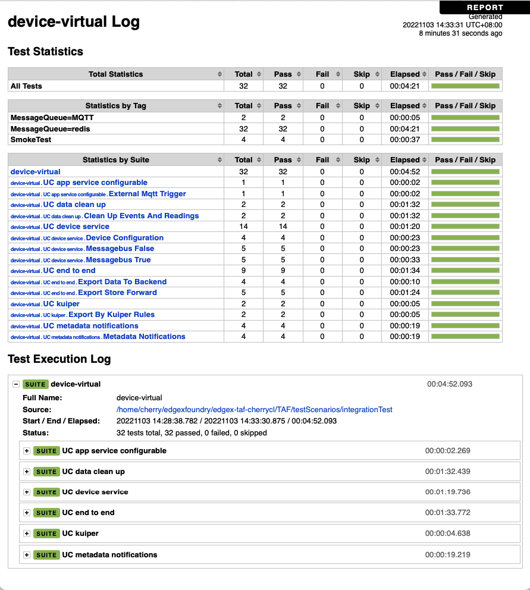

# Run Backward Compatibility Test On Local Environment

### Test Scenarios
#### Case 1
1. Deploy edgex with Jakarta release.
2. Run integration test.
3. Stop services without removing volumes
4. Redeploy services with device-services and app-services of Jakarta release and core-services of Levski release.
5. Run integration test.

#### Case 2
1. Deploy edgex with Jakarta release.
2. Run integration test.
3. Stop services without removing volumes
4. Redeploy services with device-services and app-services of Levski release and core-services of Jakarta release.
5. Run integration test.

#### Case 3
1. Deploy edgex with Jakarta release.
2. Run integration test.
3. Stop services without removing volumes
4. Redeploy services with device-services of Jakarta release, app-services and core-services of Levski release.
5. Run integration test.

#### Case 4
1. Deploy edgex with Jakarta release.
2. Run integration test.
3. Stop services without removing volumes
4. Redeploy services with app-services of Jakarta release, device-services and core-services of Levski release.
5. Run integration test.

### Prerequisites
Clone the edgex-taf project from EdgeX Foundry as a template:

``` bash
cd  /home/$USER
git clone https://github.com/edgexfoundry/edgex-taf.git
```

###  Variable configuration
Export the following variables

```
export WORK_DIR=/home/$USER/edgex-taf
```

### Run scripts
##### Parameters
- CASE: 1 to 4 (Please see cases detail on [Test Scenarions](./run-backward-compatibility-test-on-local.md#Test Scenarios)
- MESSAGE_BUS: mqtt, redis

##### Examples
```
cd $WORK_DIR/TAF/utils/scripts/docker
sh run-bct-test.sh ${CASE} ${MESSAGE_BUS}
# ex. sh run-bct-test.sh
```

### View detail execution reports
Find report file, backward-test-${MESSAGE_BUS}.html, from ${WORK_DIR}/TAF/testArtifacts/reports/cp-edgex/
See the following image as example.

