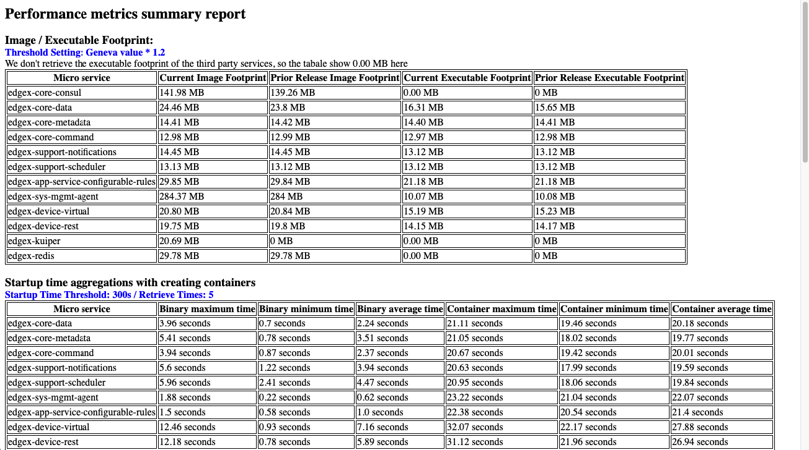

# Collect performance metrics

### Clone edgex-taf repository
Clone the edgex-taf project from EdgeX Foundry as a template:

``` bash
cd  /home/$USER
git clone https://github.com/edgexfoundry/edgex-taf.git
```

###  Variables configuration
Export the following variables that depend on running environment

```
export WORK_DIR=/home/$USER/edgex-taf

# x86_64
export COMPOSE_IMAGE=nexus3.edgexfoundry.org:10003/edgex-devops/edgex-compose:latest
export TAF_COMMON_IMAGE=nexus3.edgexfoundry.org:10003/docker-edgex-taf-common:latest

# arm64
export COMPOSE_IMAGE=nexus3.edgexfoundry.org:10003/edgex-devops/edgex-compose-arm64:latest
export TAF_COMMON_IMAGE=nexus3.edgexfoundry.org:10003/docker-edgex-taf-common-arm64:latest

```

### Run scripts
```
cd $WORK_DIR/TAF/utils/scripts/docker
sh exec_performance_metrics.sh ${USE_ARCH}
# ex. sh exec_performance_metrics.sh x86_64
```

### View detail execution reports
1. Open report file from ${WORK_DIR}/TAF/testArtifacts/reports/edgex/log.html
2. Expend test suite 9_summary_reports.summary_reports
3. See the following image as example.


### View summary reports
1. Open performance-metrics.html file from ${WORK_DIR}/TAF/testArtifacts/reports/edgex
2. See the following image as example.

