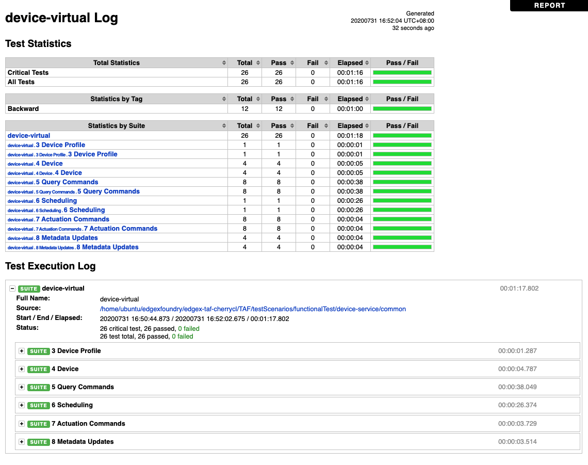
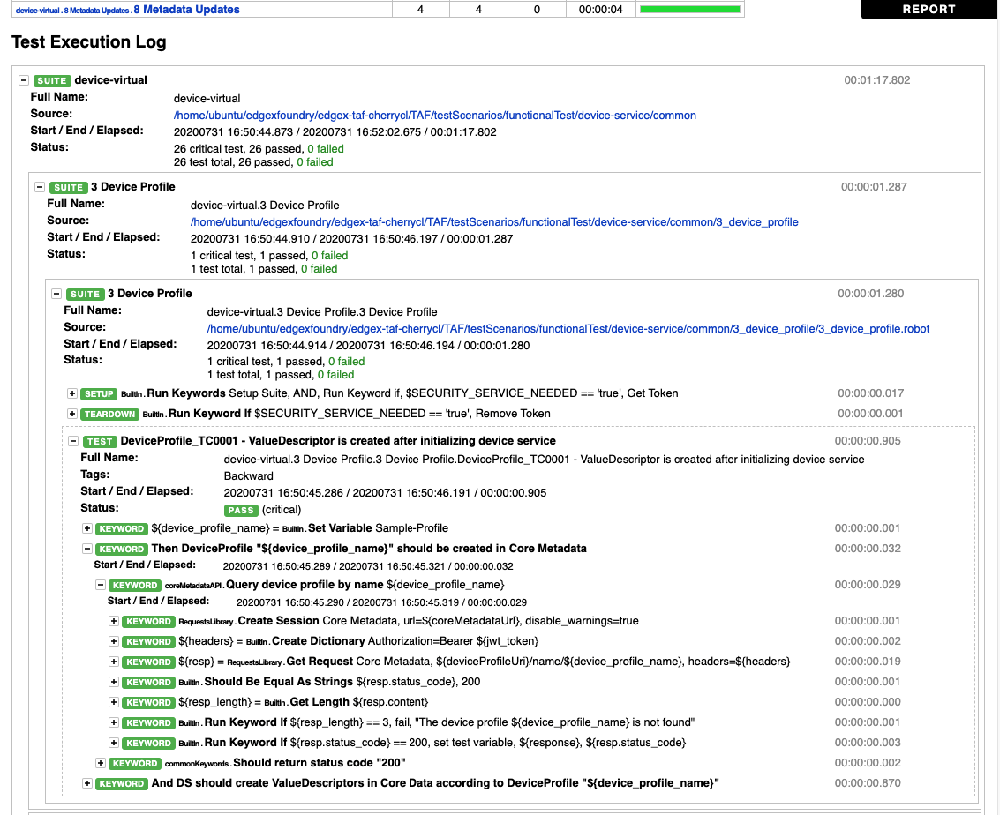
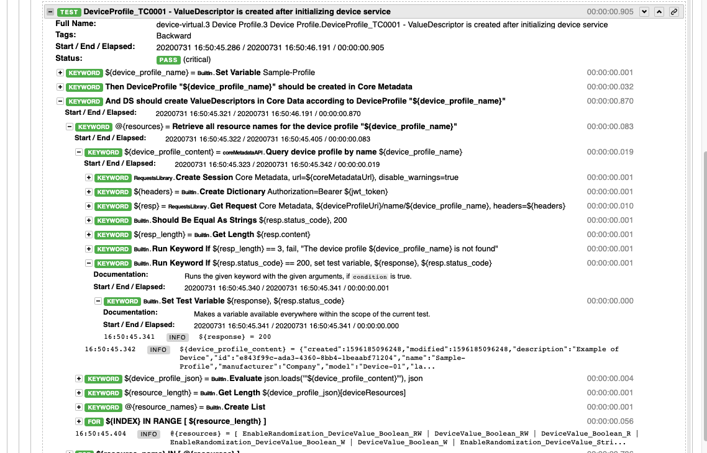

# How To Run Functional Test And Integration Test On Local
Run tests using python or a Docker container (using the edgex-taf-common image). Your choice will depend on whether you have or are willing to install the required Robot Framework libraries. If you prefer not to install libraries for testing, use of the edgex-taf-common container may be preferred.
### Prerequisites
Clone the edgex-taf project from EdgeX Foundry as a template:
``` bash
cd ${HOME}
git clone https://github.com/edgexfoundry/edgex-taf.git
```
### Use a Docker container to run tests
####  Variable configuration
``` 
# Required variables
export WORK_DIR=${HOME}/edgex-taf
```

#### Run test by shell script with arguments
`Use the shell script to run tests will take a while. It contains deploy, run tests, and shutdown steps.`
```
# Arguments for run-tests.sh
${ARCH}: x86_64 | arm64
${SECURITY_SERVICE_NEEDED}: false | true
${TEST_STRATEGY}: functional-test | integration-test
${TEST_SERVICE}: all (default) | device-virtual | device-modbus | ${directory} under TAF/testScenarios/functionalTest/V2-API | mqtt (integration-test) | redis (integration-test)
${DEPLOY_SERVICES}: no-deployment(If edgex services are deployed in place, use 'no-deployment' Otherwise, leave it empty.)

cd ${WORK_DIR}/TAF/utils/scripts/docker
sh run-tests.sh ${ARCH} ${SECURITY_SERVICE_NEEDED} ${TEST_STRATEGY} ${TEST_SERVICE} ${DEPLOY_SERVICES}

# If using x86_64, no need for secuity, adopt for functional-test, choose "v2-api" for test_service and edgex service are deployed in place, it should be:
ex. sh run-tests.sh x86_64 false functional-test v2-api no-deployment
# If using x86_64, no need for secuity, adopt for integration-test, choose "mqtt" for test_service and edgex service are not deployed in place, it should be:
ex. sh run-tests.sh x86_64 false integration-test mqtt 
```

#### View the test report
Open the report file by browser: ${WORK_DIR}/TAF/testArtifacts/reports/cp-edgex/v2-api-test.html


### Use Python to run tests
`Please delete ${WORK_DIR}/TAF/testArtifacts/reports/edgex directory by sudo first, if existed.`

#### Setup required library
1. Install pre-request packages:
    Download pip3 and run this command:
    ``` bash
    sudo apt-get install python3-pip
    ```
2. Install TAF common:
    ``` bash
    cd ${HOME}/edgex-taf
    git clone https://github.com/edgexfoundry/edgex-taf-common.git
    
    # Install dependency lib
    pip3 install -r ./edgex-taf-common/requirements.txt

    # Install edgex-taf-common as lib
    pip3 install ./edgex-taf-common
    ```
3. Prepare test environment:
    ``` bash
    # Arguments for get-compose-file.sh
    ${ARCH}: x86_64 | arm64
    ${USE_SECURITY}: - (false) | -security- (true)
    ${USE_SHA1}:main
    ${TEST_STRATEGY}: functional-test | integration-test

    # Fetch the latest docker-compose file
    cd ${HOME}/edgex-taf/TAF/utils/scripts/docker
    sh get-compose-file.sh ${USE_ARCH} ${USE_SECURITY} ${USE_SHA1} ${TEST_STRATEGY}
    # ex. sh get-compose-file.sh x86_64 - main functional-test
    
    # Export the following environment variables.
    export WORK_DIR=${HOME}/edgex-taf
    export SECURITY_SERVICE_NEEDED=false
    export COMPOSE_IMAGE=docker:20.10.18
    ```
#### Run Tests
`View the test report after finishing a python command, otherwise the report will be overridden after executing next command. Open the report file by browser: ${WORK_DIR}/TAF/testArtifacts/reports/cp-edgex/v2-api-test.html.`
1. Change directory to ${HOME}/edgex-taf
2. Deploy edgex: Skipped, if the edgex services are deployed in place
    ``` bash
    # This step may take a while if the edgex images don't exist on the machine
    python3 -m TUC --exclude Skipped --include deploy-base-service -u deploy.robot -p default
    ```
3. Run Test
    ###### Run V2 API Functional testing:
    
    - Notice: Run Functional Test will get case: IntervalactionGET006 failure. The case needs to restart service.
    - For Core Data, Core Metadata, Support Notifications, and Support Scheduler:
    ``` bash
    # ${ServiceDir}: Please use the directory name under TAF/testScenarios/functionalTest/V2-API
    
    # Run Test Command
    python3 -m TUC --exclude Skipped --include v2-api -u functionalTest/V2-API/${ServiceDir} -p default
    ``` 
    - For APP Service:
    ``` bash
    # Consul is required. Scripts will modify the APP Service configuration.
    # Used 2 profiles, funcational-tests and http-export.
   
    # Before launching APP Service, please export the following variables.
    export EDGEX_SECURITY_SECRET_STORE=false
    export SERVICE_PORT=59705 (For functional-tests)
    export SERVICE_PORT=59704 (For http-export)
   
    # Run Test Command
    export SECURITY_SERVICE_NEEDED=false  # Otherwise, will get test ErrSecretsPOST004 failed.
    python3 -m TUC --exclude Skipped --include v2-api -u functionalTest/V2-API/app-service -p default
    ```
    - Device Service:
    ``` bash
    # Before launching Device Service, please export the following variables.
    export EDGEX_SECURITY_SECRET_STORE=false
   
    # Modify the ProfilesDir value on configuration.toml under ${HOME}/edgex-taf/TAF/config/${profile}
    ProfilesDir = ${HOME}/edgex-taf/TAF/config/${profile}
   
    # Launch device service with the configDir parameter 
    --configDir=${HOME}/edgex-taf/TAF/config/${profile}
   
    # Run Test Command
    python3 -m TUC --exclude Skipped -u functionalTest/device-service -p ${profile}
    
    # ${profile}: Use the directory name under TAF/config which depends on what service to test. Examples, device-virtual or device-modbus
    ```

    ###### Run Integration testing:
    `Only support deploying edgex services through docker-compose file.`
    Run test with MQTT bus
    ```
    python3 -m TUC --exclude Skipped --include mqtt-bus -u deploy.robot -p default
    python3 -m TUC --exclude Skipped --include MessageBus=MQTT -u integrationTest -p device-virtual --name MQTT-bus
    ```
    Run test with Redis bus
    ``` bash
    python3 -m TUC --exclude Skipped --include redis-bus -u deploy.robot -p default
    python3 -m TUC --exclude Skipped --include MessageBus=REDIS -u integrationTest -p device-virtual --name REDIS-bus
    ```
4. Shutdown edgex:
    ``` bash
    python3 -m TUC --exclude Skipped --include shutdown-edgex -u shutdown.robot -p default
    ```

## Test Report Example

**Suite level example**



**Test case level example**



**Keyword level example**


