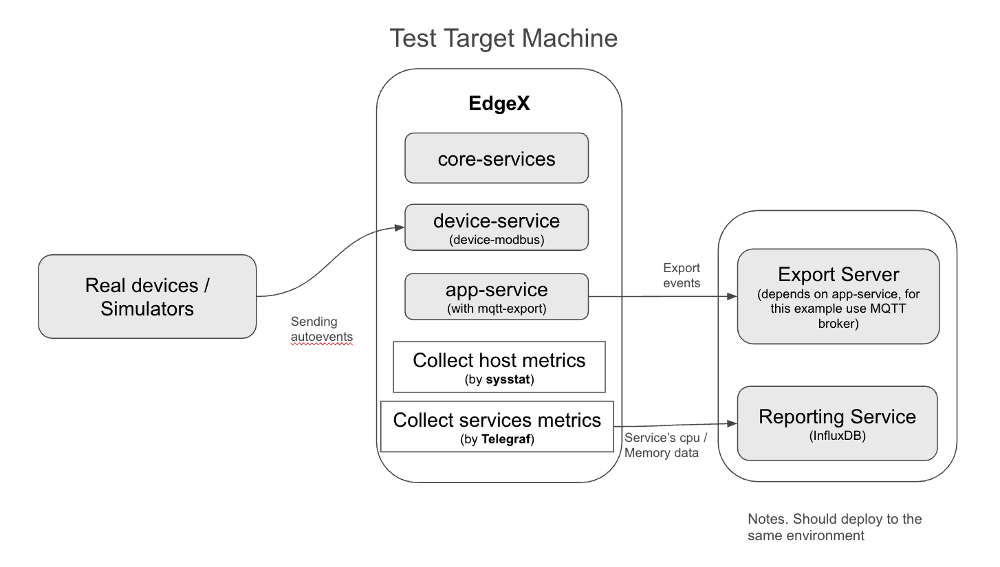

# Performance Test Introduction

## Overview

This document introduces the performance testing process based on the architecture diagram. The architecture consists of three main components:

1. **EdgeX Platform**
   - EdgeX is the core system where EdgeX services are installed.
   - Telegraf is installed to collect service container metrics.
2. **Device/Simulator**
   - This component is responsible for generating and sending data to EdgeX.
3. **Export Server and Reporting Service**
   - This server includes both the Export Server and Reporting Service as shown in the diagram.
   - It hosts InfluxDB for storing data collected by Telegraf.
   - It also runs an MQTT broker to receive events sent from the EdgeX app-service.

## Performance Testing Flow
1. The device/simulator sends data to EdgeX, which then forwards it to the MQTT broker via the EdgeX app-service.
2. Events are received over a fixed period, during which latency and throughput are measured.
3. Sysstat is used to collect host metrics, while Telegraf gathers service container metrics.

## Report Generation
To ensure accuracy across different machines, performance reports are generated on the EdgeX host machine. The report generation requires the following Python modules:
- `influxdb_client`
- `matplotlib`
- `seaborn`
- `python-dotenv`
- `paho-mqtt`

Additionally, the `jq` tool is used to retrieve the InfluxDB token and update the `telegraf.conf` file.

## Required Tools by Environment
Each environment requires specific tools and services to support performance testing:

- **EdgeX Platform**: EdgeX services, sysstat, Python modules, jq
- **Device/Simulator**: No additional tools required
- **Exporting Server**: InfluxDB, MQTT broker

## More Details for Setting Up Environment and Generating Reports
Detailed instructions for setting up the performance testing environment and generating reports can be found in the corresponding sections of this document. This includes configuring EdgeX services, setting up InfluxDB, and utilizing Sysstat and Telegraf for metric collection. There are three main ways in which to run the performance testing capability:

- [Running Performance Tests with EdgeX Docker Compose](deploy-by-docker-compose.md)

  Using this approach the services that should be tested can be easily deployed using the Docker Compose file. Service versions need to be managed manually in the file.

- [Manual Installation for existing EdgeX environments](deploy-by-manual.md) 

  This provides full control over installation and configuration of the EdgeX services (which can already be an running environment), but there are more steps to consider and verify.
